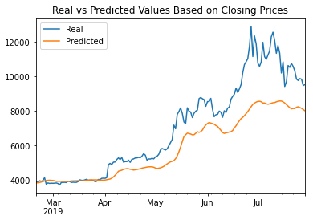
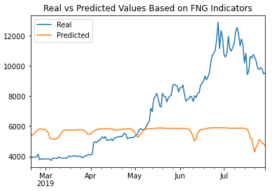

# Deep Learning Homework

## LSTM Stock Predictor

Due to the volatility of cryptocurrency speculation, investors will often try to incorporate sentiment from social media and news articles to help guide their trading strategies. One such indicator is the Crypto Fear and Greed Index (FNG) which attempts to use a variety of data sources to produce a daily FNG value for cryptocurrency.  

In this assignment, I used deep learning recurrent neural networks to model bitcoin closing prices. One model used the FNG indicators to predict the closing price while the second model used a window of closing prices to predict the nth closing price to determine if the FNG indicator provides a better signal for cryptocurrencies than the normal closing price data.

In each Jupyter Notebook, I have created the same custom LSTM RNN architecture. In the FNG notebook, I have fit the data using the FNG values. While in the Closing notebook, I have fit the data using only closing prices.  The following parameters and training steps were used for each model:

1. window size = 6
2. number of units = 5
3. dropout fraction = .08
4. epochs = 20

Using 30% of the data for testing, I have found the following:

1. The Closing model had a lower loss of 0.0267, compared to the FNG model that had a loss of 0.0988.
2. The Closing model tracks the actual values better over time compared to the FNG model.

3. The window size that works best for the 2 models is 6, compared to an initial value of 10.